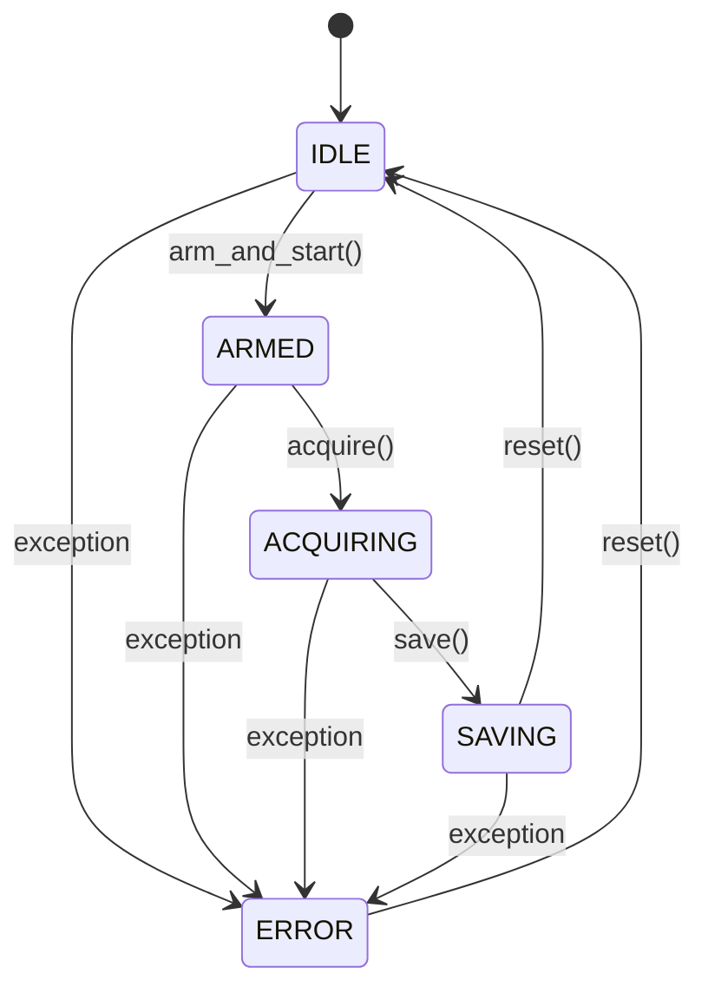

# ARCHITECTURE.md

> **Note:** All file links point to the current workspace root `c:/Users/BeamStablizer/Documents/GitHub/DAQ_CA`. Click to open the source file in the IDE.

---

## 1️⃣ Project Overview
The **DAQ_CA** repository implements a **local‑first data‑acquisition system** that is driven by an EPICS Channel Access (CA) IOC server.

* **Core goal** – provide a reliable, test‑covered acquisition pipeline that can be operated via a rich GUI client (PySide6) while keeping all low‑level driver code and the sequence controller untouched.
* **High‑level flow**
  1. The GUI (`gui/main_window.py`) runs an `EPICSWorker` in a `QThread`.
  2. The worker talks to the IOC server (`ca_server/ioc_server.py`) using `caproto` (asyncio).
  3. PV writes from the GUI trigger actions in the **SequenceController** (`core/sequence_controller.py`).
  4. The controller orchestrates **mock drivers** (`drivers/…`) to move the stage, expose the camera, and fire the DG645 pulse generator.
  5. Acquired frames are stored in a zero‑copy RAM buffer (`core/data_manager.py`) and persisted to HDF5 / TIFF files together with an Excel experiment log.

The architecture deliberately separates **UI**, **network I/O**, **business logic**, and **hardware abstraction**, enabling independent testing and future replacement of mocks with real hardware drivers.

---  

## 2️⃣ Architecture & Design Patterns

| Layer | Main Modules | Primary Pattern | Description |
|------|--------------|----------------|-------------|
| **GUI** | `gui/main_window.py` <br> `gui/main_gui.py` | **Model‑View‑Controller (MVC) – Qt** | UI widgets emit signals → `EPICSWorker` API. |
| **EPICS Worker** | `gui/main_window.py` (class `EPICSWorker`) | **Producer‑Consumer** (Qt `QThread` + asyncio) | Background thread produces PV updates; UI consumes them via Qt signals. |
| **Core Logic** | `core/sequence_controller.py` <br> `core/data_manager.py` | **State Machine** (enum `SystemState`) <br> **Manager Pattern** (DataManager) | `SequenceController` enforces state transitions (IDLE → ARMED → ACQUIRING → SAVING → IDLE/ERROR). |
| **Hardware Abstraction Layer (HAL)** | `drivers/base_driver.py` (abstract bases) <br> `drivers/mock_stage_driver.py` <br> `drivers/mock_camera_gui.py` <br> `drivers/mock_dg645_driver.py` | **Strategy / Abstract Factory** | Concrete drivers (mock or real) can be swapped without touching core. |
| **IOC Server** | `ca_server/ioc_server.py` <br> `ca_server/device_status.py` | **Server‑Client** (EPICS CA) | Exposes PVs, handles client connections, forwards commands to `SequenceController`. |
| **Tools** | `tools/pv_map_manager.py` | **Utility** | Manages PV‑to‑device mapping, provides device‑creation wizard. |

### Dataflow (D)
```
GUI  →  EPICSWorker (Qt signal → caproto write)  →  IOC PVs  →  SequenceController  →  Drivers  →  Sensors/Actuators
```

### Control Flow (C)
```
User clicks ARM → GUI writes PV → EPICSWorker receives ack → SequenceController.arm_and_start()
→ Buffer allocation (DataManager) → Camera.start_stream() → Stage is checked (is_moving) → DG645.trigger()
→ Frames captured → DataManager.save_* → UI state updates (state_changed signal) → Console log
```

---

## 3️⃣ Hardware Abstraction Layer (HAL)

| Instrument | Driver Class | Source File | Communication Interface (mock) |
|------------|--------------|------------|--------------------------------|
| **Stage (Faulhaber)** | `MockStageDriver` (implements `BaseStageDriver`) | [mock_stage_driver.py](file:///c:/Users/BeamStablizer/Documents/GitHub/DAQ_CA/drivers/mock_stage_driver.py) | Simulated via Python `threading`; real implementation would use **RS232** or **Ethernet** (TCP/IP). |
| **Camera** | `MockCameraGUI` (implements `BaseCameraDriver`) | [mock_camera_gui.py](file:///c:/Users/BeamStablizer/Documents/GitHub/DAQ_CA/drivers/mock_camera_gui.py) | Simulated image generation; real hardware would use **GigE Vision** (UDP over Ethernet). |
| **Delay Generator (DG645)** | `MockDG645Driver` (implements `BaseDG645Driver`) | [mock_dg645_driver.py](file:///c:/Users/BeamStablizer/Documents/GitHub/DAQ_CA/drivers/mock_dg645_driver.py) | Simulated trigger; real device talks over **RS232** (serial) or **USB‑TMC**. |
| **IOC Server** | `DeviceStatus` + `run_ioc_gui` | [ioc_server.py](file:///c:/Users/BeamStablizer/Documents/GitHub/DAQ_CA/ca_server/ioc_server.py) | EPICS Channel Access (CA) over UDP/TCP (standard EPICS). |

> **Future real‑hardware integration** – replace the mock driver classes with concrete implementations that obey the same abstract base interfaces, keeping the rest of the system unchanged.

---

## 4️⃣ Mermaid Diagrams

### 4.1 Block Diagram (System Layers)
```mermaid
graph LR
    subgraph UI["GUI (PySide6)"]
        A[MainWindow UI] --> B[EPICSWorker (QThread)]
    end

    subgraph EPICS["EPICS CA"]
        B --> C[Caproto Context]
        C --> D[IOC Server\n(ca_server/ioc_server.py)]
    end

    subgraph Core["Core Logic"]
        D --> E[SequenceController\n(core/sequence_controller.py)]
        E --> F[DataManager\n(core/data_manager.py)]
        E --> G[Stage Driver\n(drivers/mock_stage_driver.py)]
        E --> H[Camera Driver\n(drivers/mock_camera_gui.py)]
        E --> I[DG645 Driver\n(drivers/mock_dg645_driver.py)]
    end

    subgraph HW["Hardware (Mock)"]
        G --> G1[Stage (Faulhaber)]
        H --> H1[Camera (GigE)]
        I --> I1[DG645 Pulse Generator]
    end

    style UI fill:#f9f9f9,stroke:#333,stroke-width:2px
    style EPICS fill:#e8f5ff,stroke:#333,stroke-width:2px
    style Core fill:#e6ffe6,stroke:#333,stroke-width:2px
    style HW fill:#ffe6e6,stroke:#333,stroke-width:2px
```

### 4.2 State Machine (SequenceController)


---

## 5️⃣ Module & File Map (Responsibilities)

| File | Responsibility |
|------|----------------|
| **`gui/main_window.py`** | Qt UI definition, `EPICSWorker` thread, signal wiring, live image view, console logging. |
| **`gui/main_gui.py`** | Small launcher (`python -m gui.main_gui`). |
| **`core/sequence_controller.py`** | Orchestrates the acquisition sequence, maintains `SystemState`, interacts with drivers & `DataManager`. |
| **`core/data_manager.py`** | Zero‑copy RAM buffer allocation, HDF5/TIFF persistence, Gaussian fitting, experiment‑log handling. |
| **`drivers/base_driver.py`** | Abstract base classes for Stage, Camera, DG645 (Strategy pattern). |
| **`drivers/mock_stage_driver.py`** | Mock stage implementation (position, move, limits). |
| **`drivers/mock_camera_gui.py`** | Mock camera providing synthetic frames for UI preview. |
| **`drivers/mock_dg645_driver.py`** | Mock DG645 trigger generator. |
| **`ca_server/ioc_server.py`** | EPICS Channel Access server, PV definitions, linking PV changes to `SequenceController`. |
| **`ca_server/device_status.py`** | Helper utilities for reporting device status (connected / disconnected). |
| **`ca_server/run_ioc_gui.py`** | Simple launcher for the IOC server (used by developers). |
| **`ca_server/server_gui.py`** | Optional GUI for visualising server status (not part of the main flow). |
| **`tools/pv_map_manager.py`** | Spreadsheet‑style PV‑to‑device mapper, includes “Add New Device Wizard”. |
| **`tests/…`** | Unit‑test suite (pytest) covering all core and driver functionality. |
| **`DEVELOPMENT_LOG.md`** | Chronological log of development tasks, bug‑fixes, and feature additions. |
| **`SYSTEM_OPERATION_MANUAL.md`** | (Generated elsewhere) end‑user manual describing GUI usage and PV list. |
| **`requirements.txt`** | Pin‑pointed Python dependencies for the whole project. |

---

## 📎 How to Use This Document
* Open any file directly from the table above by clicking its link.
* The Mermaid diagrams render in the repository viewer (GitHub, VS Code, or the Antigravity IDE).
* When adding a new hardware device, create a concrete driver that inherits from the appropriate abstract base in `drivers/base_driver.py` and register its PVs in `ca_server/ioc_server.py`.

---

**End of ARCHITECTURE.md**
