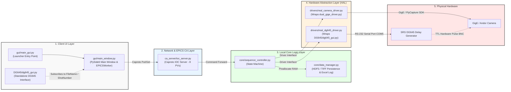

# Physical DAQ Test System Architecture Specification (DG645 + Camera Minimal Version)
# Architecture & PFD Specification: DG645 + Camera Test System

> **Project Note**: This document serves as a lightweight architecture specification for the **DAQ_CA** system, specifically tailored for physical hardware testing (DG645 Delay Generator + GigE/Andor Camera).

---

## 1️⃣ Core Design Principles

1. **Status-Only Exposure**:
   * Detailed parameters for the DG645 and camera (e.g., exposure time, gain, delay settings) **will not be exposed via EPICS**. These remain pre-configured locally via standalone interfaces or drivers.
   * The EPICS network layer monitors hardware connection status (`Status`) only, ensuring 100% stability and zero network overhead on Channel Access.
2. **Static Trigger Configuration**:
   * **No dynamic trigger mode switching** occurs during the acquisition process. The camera is pre-configured for External Trigger mode, and the state machine simply verifies that `CameraStatus == "CONNECTED"` during the `ARMED` stage.
3. **Global PV Synchronization**:
   * `FileName` and `ShotNumber` are broadcast globally via EPICS. Whether updated from the main GUI (`main_window.py`), secondary instrument GUIs (`dg645_gui.py`), or through auto-incrementing, all client windows remain synchronized in real time.

---

## 2️⃣ Master PV Map (8 Minimal EPICS PVs)

| EPICS PV Name | Data Type | Access | Default | Responsible Python Script / Description |
| :--- | :--- | :--- | :--- | :--- |
| **`EXP:Seq:ShotTarget`** | `int` | RW | `1` | `ioc_server.py` $\rightarrow$ `sequence_controller.py` (Sets total shot count per run) |
| **`EXP:Seq:Arm`** | `int` | RW | `0` | `main_window.py` $\rightarrow$ `ioc_server.py` (Write `1` to trigger DAQ sequence) |
| **`EXP:Seq:State`** | `str` | RO | `IDLE` | `sequence_controller.py` $\rightarrow$ `ioc_server.py` (Real-time state: IDLE/ARMED/SAVING/ERROR) |
| **`EXP:Seq:FileName`** | `str` | RW | `exp_run` | `ioc_server.py` $\rightarrow$ `data_manager.py` (Output filename prefix; synced across UIs) |
| **`EXP:Seq:ShotNumber`** | `int` | RW | `0` | `sequence_controller.py` $\rightarrow$ `ioc_server.py` (Experiment shot index counter; synced across UIs) |
| **`EXP:Seq:ErrorMessage`** | `str` | RO | `""` | `sequence_controller.py` $\rightarrow$ `ioc_server.py` (System and hardware exception messages) |
| **`EXP:Seq:DG645Status`** | `str` | RO | `DISCONNECTED` | `real_dg645_driver.py` $\rightarrow$ `ioc_server.py` (RS-232 serial connection status) |
| **`EXP:Seq:CameraStatus`** | `str` | RO | `DISCONNECTED` | `real_camera_driver.py` $\rightarrow$ `ioc_server.py` (Camera SDK / network connection status) |

---

## 3️⃣ System Architecture & Python Script Layering



---

## 4️⃣ DAQ Control & Code Call Execution Flow

This flow chart details the call stack and execution sequence triggered when a user clicks **ARM & START DAQ** in `gui/main_window.py`:

```text
[User clicks "ARM & START DAQ" in gui/main_window.py]
       │
       ▼
 1. gui/main_window.py (Class: MainWindow)
    ├── Reads current ShotTarget and FileName from UI
    └── Calls EPICSWorker to issue Caproto Put: EXP:Seq:Arm = 1
       │
       ▼
 2. ca_server/ioc_server.py (Class: DAQIOC)
    ├── Receives Arm = 1 write event via @Arm.putter
    ├── Updates EXP:Seq:State = "ARMED"
    └── Spawns background task: self._execute_daq_sequence()
       │
       ▼
 3. core/sequence_controller.py (Class: SequenceController)
    ├── [ARMED Stage] Validates DG645Status == "CONNECTED" and CameraStatus == "CONNECTED"
    │                 (Note: Static validation only; no dynamic trigger mode switching)
    ├── [ARMED Stage] Calls core/data_manager.py to pre-allocate zero-copy NumPy RAM buffers
    ├── [ACQUIRING Stage] Updates EXP:Seq:State = "ACQUIRING"
    ├── [ACQUIRING Stage] Calls drivers/real_dg645_driver.py to issue RS-232 *TRG pulse
    ├── [ACQUIRING Stage] Camera receives TTL pulse and streams frame into pre-allocated RAM
    └── [SAVING Stage] Calls core/data_manager.py to execute data persistence:
           ├── Exports HDF5 / TIFF image files (Format: {FileName}_shot_{ShotNumber:04d}.h5)
           └── Automatically appends experiment metadata entry to experiment_log.xlsx
       │
       ▼
 4. ca_server/ioc_server.py
    ├── Restores EXP:Seq:State = "IDLE"
    ├── Resets EXP:Seq:Arm = 0
    └── Automatically increments EXP:Seq:ShotNumber (+1)
       │
       ▼
 5. Global Client GUI Sync (main_window.py / dg645_gui.py / camera_gui)
    └── Subscribed clients receive broadcast updates and refresh UI elements to reflect IDLE state and new ShotNumber
```

---

## 5️⃣ Module Responsibilities

* **`gui/main_gui.py`**: Lightweight launcher script that configures `sys.path` and initializes the main application.
* **`gui/main_window.py`**: PySide6 main window. Draws control panels, displays device status badges (DG645/Camera), renders live image previews, and handles non-blocking network I/O via `EPICSWorker` (`QThread`).
* **`DG645/dg645_gui.py`**: Standalone control panel for the DG645 delay generator. Features a background polling thread to stay synchronized with global `FileName` and `ShotNumber` PVs.
* **`ca_server/ioc_server.py`**: EPICS Channel Access IOC Server. Exposes the 8 core PVs and isolates blocking network/hardware operations using an asynchronous thread pool (`asyncio.to_thread`).
* **`core/sequence_controller.py`**: Core DAQ state machine. Handles pre-arm readiness checks and orchestrates timing between drivers and the DataManager.
* **`core/data_manager.py`**: Memory and persistence manager. Handles RAM buffer pre-allocation, HDF5/TIFF image export, and auto-logging to Excel.
* **`drivers/real_dg645_driver.py`**: Hardware driver wrapper for the DG645. Manages RS-232 serial communication and `*TRG` pulse generation.
* **`drivers/real_camera_driver.py`**: Hardware driver wrapper for the camera stack. Interfaces with lower-level camera SDKs, providing frame acquisition and connection status monitoring.
